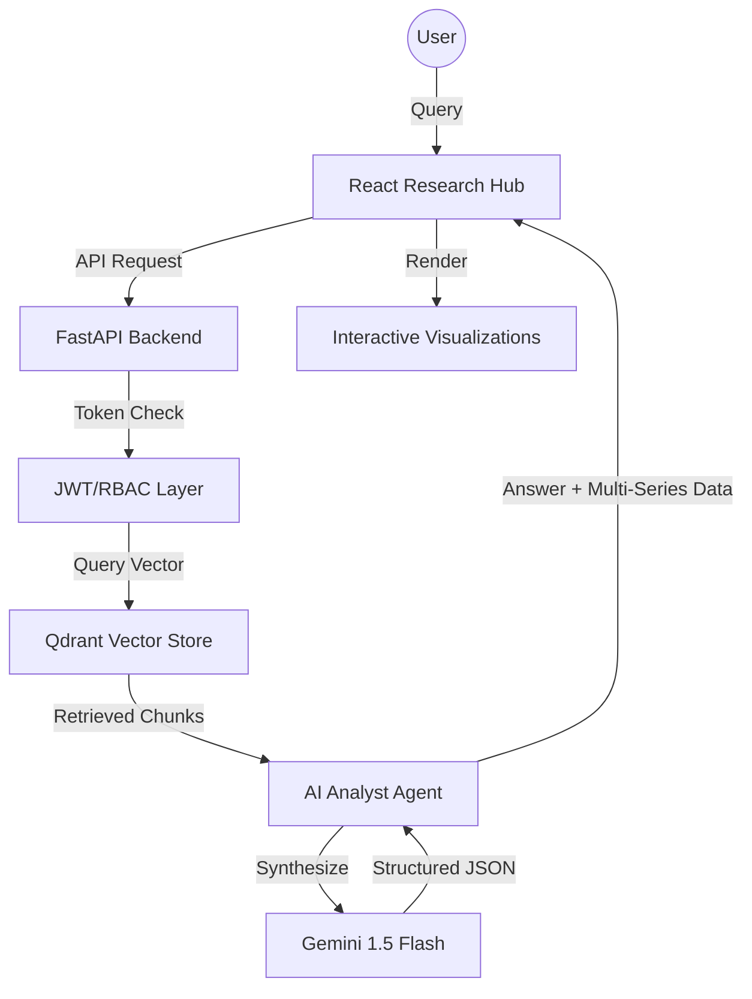

# 💎 FinVision: Enterprise AI Financial Analyst

**FinVision** is a next-generation analytical platform designed to transform raw financial documents (Annual Reports, Balance Sheets, Invoices) into actionable, visualized intelligence. Using **Retrieval-Augmented Generation (RAG)** and **Agentic Reasoning**, FinVision moves beyond simple text-chat to provide deep computational analysis and professional data visualization.

---

## 🚀 Key Features

### 📊 Agentic Multi-Series Analytics
The core of FinVision is the **AI Analyst Agent**. Unlike standard LLM implementations, it doesn't just answer questions—it analyzes data patterns and generates structured JSON to power interactive **Multi-Series Charts**. 
*   *Example: Compare "Net Sales" vs "Operating Profit" side-by-side automatically.*

### 🔍 High-Precision RAG Pipeline
Utilizing **Qdrant Vector Database** and **Sentence-Transformers**, the system performs semantic search across large document repositories. By retrieving only the most relevant "financial chunks," it eliminates AI hallucinations and provides direct citations for every number.

### 🛡️ Enterprise-Grade Security (RBAC)
Built with professional security in mind, the platform features:
*   **JWT Authentication**: Secure session management.
*   **Role-Based Access Control (RBAC)**: Fine-grained permissions for **Admin**, **Analyst**, **Auditor**, and **Client** roles.

### 💎 Premium User Experience
A high-fidelity **Glassmorphic UI** built with **React** and **Framer Motion**, featuring:
*   Real-time financial metric cards.
*   Smart research hub with AI-driven prompt suggestions.
*   Responsive, animated visualization panels.

---

## 🛠️ Technology Stack

| Layer | Technology |
|---|---|
| **Artificial Intelligence** | Google Gemini 1.5 Flash (LLM), RAG Pipeline |
| **Vector Engine** | Qdrant (Vector Database) |
| **Embeddings** | Sentence-Transformers (all-MiniLM-L6-v2) |
| **Backend** | FastAPI (Python), SQLAlchemy, SQLite, JWT |
| **Frontend** | React (Vite 6), Recharts, Framer Motion, Lucide |
| **Containerization** | Docker, Docker-Compose |
| **Deployment** | Railway.app (Production Ready) |

---

## 📐 Architecture Overview



---

## 🐳 Production Deployment

The project is fully optimized for cloud deployment (specifically **Railway.app**).

### 1. Cloud Optimization (The 4GB Solution)
The production environment uses a specialized `backend.Dockerfile` that utilizes **CPU-only torch builds**. This reduces the image footprint from **6GB+ to under 4GB**, ensuring compatibility with standard cloud free-tiers and high-speed deployments.

### 2. Environment Configuration
To run in production, set the following variables in your cloud dashboard:

| Variable | Description |
|---|---|
| `VITE_API_URL` | Public URL of your Backend API. |
| `GOOGLE_API_KEY` | Your Google Gemini API Key. |
| `QDRANT_HOST` | Internal/External address of the Qdrant service. |
| `SECRET_KEY` | Random string for JWT token security. |

---

## 🚦 Local Setup

### 1. Prerequisites
*   Python 3.10+
*   Node.js 20+
*   Google Gemini API Key

### 2. Quick Launch (Docker)
```bash
docker-compose up --build
```
This will start the **React UI** (Port 80/8080), **FastAPI Engine** (Port 8000), and **Qdrant DB** (Port 6333) as a synchronized team.

---

## 💡 Smart Query Examples

*   **Grouped Comparison**: *"Compare Net Sales and Operating Profit for 2021-2023. Show me a bar chart."*
*   **Trend Tracking**: *"Identify the revenue trend for the MAGGI brand. Use a line chart."*
*   **Risk Assessment**: *"Summarize the top internal control risks and the mitigation strategy found in the report."*

---

## 🔒 Security & Self-Healing
The project includes self-healing database dependencies. Upon the first login of an `admin` user, the system automatically detects missing roles and seeds the database with enterprise permissions to prevent access blockers.

---
© 2026 Financial Document AI System. Built for Precision Financial Research.
